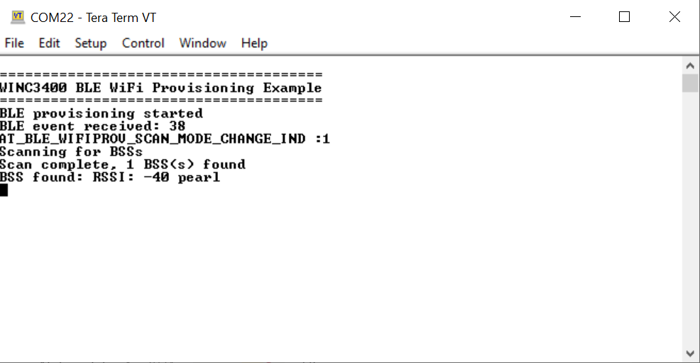
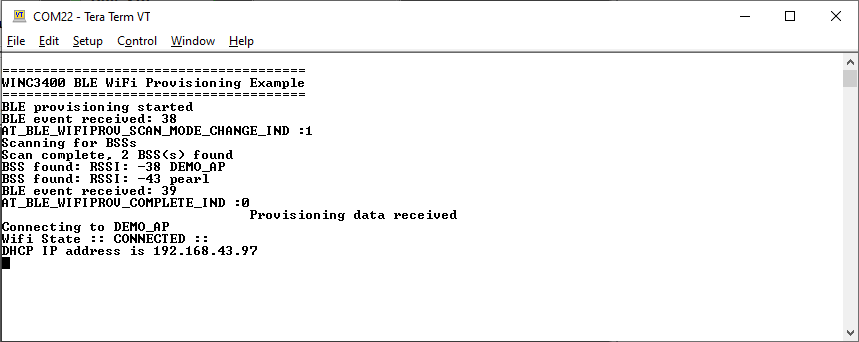

# Wi-Fi provisioning using BLE 

This example demonstrates how to pass the AP credentials to WINC3400 device via BLE.

## Description

This application demonstrates how a user can pass the target AP credentials to WINC3400 device via BLE. The user would need to use "Microchip Bluetooth Data" mobile application to pass the AP credentials to WINC3400 after pairing with the mobile.

## Downloading and building the application

To download or clone this application from Github, go to the [top level of the repository](https://bitbucket.microchip.com/projects/WSGSW/repos/wireless_wifi)

Path of the application within the repository is **apps/wifi_provision_via_ble/firmware** .

To build the application, refer to the following table and open the project using its IDE.

| Project Name      | Description                                    |
| ----------------- | ---------------------------------------------- |
| sam_a5d27_som1_winc3400.X | MPLABX project for SAMA5D27 and WINC3400 Xplained pro
|||

### Setting up [SAMA5D27-SOM1-EK1 Evaluation Kit](https://www.microchip.com/DevelopmentTools/ProductDetails/atsama5d27-som1-ek1)

- Connect the Debug USB port on the SAMA5D27-SOM1-EK1 board to the computer using a micro USB cable
- Make sure to connect WINCxxxx XPRO with SAMA5D27-SOM1-EK1 board using Custom mikroBUS to XPRO adapter, WINCxxxx on MBus1.
#### Setting up the SD Card

- Download harmony MPU bootstrap loader from this [location](firmware/at91bootstrap_sam_a5d27_som1_ek.X/binaries/boot.bin)
- Copy the downloaded boot loader binary( boot.bin) onto the SD card
- Copy the application (harmony.bin) from "firmware/sam_a5d27_som1_winc3400.X/dist/sam_a5d27_som1_winc3400/production" onto the SD card, 
  available after a successful build of the application (Refer to the 'Running the Application' section below)

#### Setting up the board

- Insert the FAT32 formatted SD card with the boot.bin and harmony.bin (Refer to the 'Running the Application' section below) to J12
- Connecting a micro-USB cable to J10 both powers the board as well as provides a virtal COM port to open a serial terminal

## Running the Application

1. Open the project.

2. Build and program the generated code into the hardware using its IDE.
	 - Note: at91bootstrap_sam_a5d27_som1_ek.X project is linked to application project and is required to program the application on SAMA5D27-SOM1-EK1. 	 

3. Refer "firmware update guide" and "WINC Driver Demonstrations" for information.

4. To upgrade the firmware on WINC1500/WINC3400 
	 - use the Host SAMD21/SAME54 using serial_bridge application

5. Open the Terminal application (Ex.:Tera term) on the computer

6. Connect to the "USB to UART" COM port and configure the serial settings as follows:

    * Baud : 115200
    * Data : 8 Bits
    * Parity : None
    * Stop : 1 Bit
    * Flow Control : None

7. Download the Microchip Bluetooth Data application from App Store and open it.

8. The WINC3400 device will scan the APs and ready to get paired with Mobile application.

9. In the Mobile Application, Open the "Ble provisioner" widget.

10. In the "Ble provisioner" widget, press the "scan" button. It will list the surrounding BLE devices. 

11. The default name given for WINC3400 in the "Wi-Fi provisioning using BLE" application is "Wifi Prov". Click on "Wifi Prov" device.

12. The next screen will display the scanned AP list. 

13. Select the desired AP from the scan list and provide the required credentials to make Wi-Fi connection.

14. Press "Provision" button

15. The mobile application will ask for the password to pair.

16. The password is stored in the "pincode" variable in the "wifi_prov.c" file.

17. Enter the password to pair the WINC3400 device with mobile.

18. The device will connect to the AP and print the IP address obtained.

